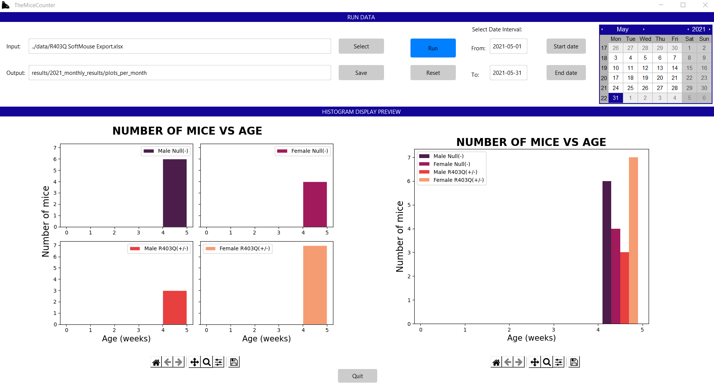

# TheMiceCounter

TheMiceCounter is an application for managing mice litter's data. The app allows the user to choose specific information of a mice litters, such as id, genotype, sex, date of birth, age, etc. and creates excel files showing that data in either a new excel Workbook or a new sheet of a pre-existing one.  Additionally, it plots the Number of mice vs their Age saves the plot both as a JPG file in a different folder and in the excel file the user created. This application was created to use the data downloaded from RedCap, and it is intended to grow so that the user can directly use data from it to create excel files with plotted data. [Stay tuned](pages/stay tuned/stay tuned.html) for new updates on the app.

  + This application is written in Python and uses it's Graphical User Interface toolkit: Tkinter.

Ideally, the application should work on any computer that has Excel. The result are shown in the following image:

## Organization

The main components of the software are divided into two different frames:
+ [Run Data](pages/Run Data/Run Data.html) - the core section where the input data can be selected.
+ [Histogram Display Preview](pages/Histogram Display Preview/Histogram Display Preview.html) - accessory display where the images created by the simulation can be seen previous to being saved in the excel file. This makes it easier to run different periods of time and analyze the outputs.

## Getting started
Check the [installation](pages/installation/installation.html) to download the application.

Check the [demos](pages/demos/demos.html) to see how to:
+ Introduction to the application
+ Start creating excel files and/or excel sheets with new data