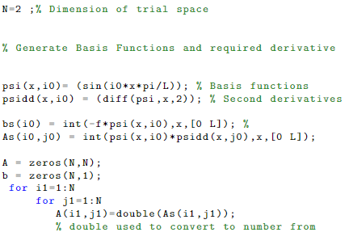

# Following the codes

Next, I will show the the codes in Matlab for each of the problems. You can check my code files [here](https://github.com/Giusseppe-97/Uncertainty_Quantification\docs\pages\demos\Getting Started\/code/).

# Poisson's equation:

# Stochastic Galerkin Problem 

#  Stochastic Collocation Problem

