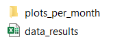
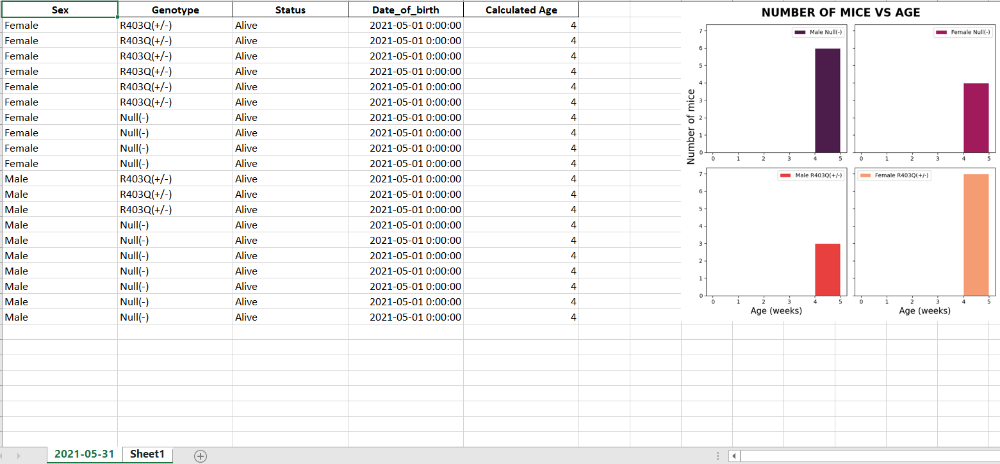

# Step by step

## Overview

After following the [Run Data](../Run Data/Run Data.html) and the [Histogram Display Preview](../installation/Running the App/Running the App.html) instructions, TheMiceCounter application will have created some new documents locaterd in the result folder located in `<repo>/code/results`. 

## What this demo does

This demo:

+ Locate the results
    - 'year'_monthly_results
        - plots_per_month
        - data_results

+ Differentiate between a new Excel workbook and a pre-existing one

### Viewing the results

As mentioned before, all of the results obtained from running the application are written in the result folder located in `<repo>/code/results`. 

A subfolder named `<(year)_monthly_results>` (as shown below) has all of the information of a lattice Ran that specific year. In case there are experiments longer than a year, a new subfolder would be created automatically. In this case, it has the data of a mice lattice this year (2021).


This folder contains the different files specific of the mice lattice the user is looking into. It is divided into two parts:

+ The excel workbook, always saved as `<data_results>`. 

+ A `<plots_per_month>` folder which contains all of the plots created by the user with the application. 

Both the excel workbook and the plots_per_month folder carry information the user created with the application and will be explained next.

### Understanding the results

The file `plots_per_month.PNG` and `data_results.png` are shown like this:



In here, one file has the data of the mice and the other stores the plots from the application as a png file. 

The excel file that is created has the data of the mice and a plot of the corresponding period of time. Each sheet has a different date
of the final day wanted to be ploted.

For instance, results for the month of May look something like this:



## How this worked

This demonstration explains the creation of a '<(year)_monthly_results>' with its subfolders: plots_per_month and data_results.

The simulation was controlled by a class in TheMiceCounter application (shown below).

This class, labelled `FolderManager` Enables the developement and management of folder structures for multipurpose projects with datetime configurations.

The file defines the different functions needed for this class to create every specific folder and name it appropiately.

__init__function: initializes the current time and the other functions of the class.

get_current_important_values: extract the current year, month and day.

save_image: plots the image with the date as its name.

generate_folder_paths: gets path to both the yearly folder and the plots_per_month folder if inexistent.

creates_folder: if if the paths created by generate_folder_paths don't exist, it creates them.

get_path_for_results: finally the results path is returned.


````
class FolderManager:

    def __init__(self, app_object):
        self.app_object = app_object
        self.current_datetime = dt.now()
        self.get_current_important_values()
        self.generate_folder_paths()
        self.create_folders()
        self.save_image()

    def get_current_important_values(self):
        self.year = self.current_datetime.strftime("%Y")
        self.month = self.current_datetime.strftime("%B")
        self.week = self.current_datetime.strftime("%W")

    def save_image(self):
        if self.app_object.init_month != self.app_object.final_month:
            self.plot_4_name = str(self.app_object.init_month) + \
                "-" + str(self.app_object.final_month)
        else:
            self.plot_4_name = str(self.app_object.init_month)

        self.filepath_4_plot = str(self.app_object.filepath2) + "/" + \
            str(self.plot_4_name)+".png"
        self.hist_4_plot = plt.savefig(self.filepath_4_plot)

    def generate_folder_paths(self):
        self.current_directory = os.path.abspath(os.path.dirname(__file__))

        self.directory_per_month = os.path.join(
            self.current_directory,
            "results",
            "{}_{}".format(
                self.year,
                "monthly_results"
            )
        )
        self.directory_plots_month = os.path.join(
            "results",
            "2021_monthly_results",
            "{}".format("plots_per_month")
        )

    def create_folders(self):
        if not os.path.exists(self.directory_per_month):
            os.makedirs(self.directory_per_month)

        if not os.path.exists(self.directory_plots_month):
            os.makedirs(self.directory_plots_month)

    def get_path_for_results(self):
        return self.directory_per_month
````

This instructed TheMiceCounter to:
+ know where to locate the results folder
+ save the data to `code/year_monthly_results/data_results.xsxl`  
+ save the plots to `code/year_monthly_results/plots_per_month`

