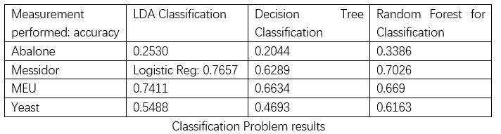

#  Summary

Next, I will show the comparisson of the algorithms chosen for each dataset.

Note: I chose to do my parameter analysis on the Messidor dataset, so you will also have access to that page.  

# Yeast
This dataset aims to describe the different types of protein at a yeast’s localization site. My target was then classifying which protein is in the yeast-specific location. To do so, I used the following three algorithms:
LDA
Classification tree
Random Forrest
The performance of the LDA was …, the performance of the Classification tree was … and the performance of the Random Forrest was …. This can also be seen in the image above. 
LDA has some advantages. It is a very simple algorithm and is fast to implement. It also shows fast results. It can perform better than other algorithms when its assumptions are met. LDA for this particular dataset did not perform well. This might be because it required normal distribution assumption on features/predictors, and might be dealing with too few categories of variables. For the classification tree, it showed a great accuracy for the training data, but a very low accuracy for the testing data. 
To verify that the algorithm was indeed working I implemented some pruning and the results seemed more real. The accuracy for the training data decreased while the accuracy for the validation and testing data stay the same. This meant that for this particular dataset, a classification tree was not the best option. Yet, I could always try to implement the Random Forrest to see if the results might have improved. This was actually the case. The results improved, however, there is less possible interpretability, given that it is somehow a black-box approach. Also, there is a possibility that it is overfitting the data. Additionally, it required more computational resources
And the prediction time was high.

# Abalone:
This dataset is predicting the age of the abalone from physical measurements. The age of abalone is determined by cutting the shell through the cone, staining it, and counting the number of rings through a microscope -- a boring and time-consuming task. Other measurements, which are easier to obtain, are used to predict age. To do so, I used the following three algorithms:
LDA
Classification tree
Random Forrest
This was an interesting dataset to analyze because of the difficulty stated in the literature. Clearly, identifying the age of these shells is hard given the number of possibilities (27 different ages). In the end, all algorithms performed poorly. The performance of the LDA was …, the performance of the Classification tree was … and the performance of the Random Forrest was …. This can also be seen in the image above.
 I was expecting to get better performance, but it also makes sense that for so many possible predictions the accuracy was lower. The three algorithms took a lot of time to run, and struggled to give good results. After getting disappointing results, I decided to fix this, and approached the challenge a bit differently. I converted the problem into a binary prediction between young and old abalones. Abalones younger than 8 years were classified as young while older than 8 were classified as old. The performance went from 20% average accuracy of the first 3 algorithms to almost 67% accuracy. Of course, this is an easier problem to solve, yet sometimes it is better to lower the scope of the problem rather than try to justify poor results. With the difference between young and old, I can have a better interpretation of the data, which is in the end what we want.

# MEU
This dataset aims to somehow describe mobile screens' use. Our target is classifying the subjects based on their finger and movement attributes. To do so, I used the following three algorithms:
LDA
Classification tree
Random Forrest
The performance of the LDA was …, the performance of the Classification tree was … and the performance of the Random Forrest was …. This can also be seen in the image above.
For this dataset, the results were very good. It really helped that the data was very clear, well-labeled, and easily understandable. This made my job easier when preprocessing the data. Accuracy was high given that LDA works very well in making assumptions. Then for the classification tree, you see the difference between the training, validation, and testing data performance. The training optimizes the objective function. The validation models the selection by being able to compare different data k-fold splits and get a sense of how well they work in practice, and the testing estimates the overall performance. By including the validation in the classification tree, we guarantee that the machine doesn’t bias towards the separate set. You can see that the performance is already very good after pruning. I also run a correlation matrix seen in the code to verify that the features were correlating. This is because Classification trees don’t work when variables are uncorrelated. Finally, the random Forrest doesn’t improve compared to the first two. Maybe it overfitted the data. 

# Messidor
This dataset aims to features extracted from the Messidor image set to predict whether an image contains signs of diabetic retinopathy or not. All features represent either a detected lesion, a descriptive feature of an anatomical part, or an image-level descriptor. Our target is to classify whether it contains signs of DR (Accumulative label for the Messidor classes 1, 2, 3) or no signs of DR. To do so, I used the following three algorithms:
Logistic regression 
Kernelized SVM 
Classification tree 
The performance of the Logistic regression was …, the performance of the Kernelized SVM was… and the performance of the Classification tree was ….
I additionally added Random Forest and Adaboost because I did my parameter analysis for this dataset and wanted more information about it. 
The performance of the Random Forrest was … and after the Adaboost was…. This can also be seen in the image above.
The logistic regression worked very well. Of course, that logistic regression doesn’t assume a linear relationship between independent and dependent variables, that the dependent variables do not need to be normally distributed, and that no homogeneity of variance assumption was required considerably help this algorithm perform so well. Support Vector Machine also worked beautifully. We know SVM works relatively well when there is a clear margin of separation between classes, and given that it was a binary dataset, this was not a problem. 
I cannot discriminate against machine learning models purely based on pros and cons. The selection of the machine learning model should be based on the data and expertise of what I want to analyze. Therefore, I took my time to play around with this dataset a bit more. In a nutshell, DR is an eye complication that affects around 40% of people with diabetes, leading to blindness. If detected in time can be slowed down. 
This dataset is composed of features extracted from the output of several retinal image processing algorithms, such as:
- imagelevel (quality assessment, pre-screening, AM/FM)
- lesion-specific (microaneurysms, exudates) 
- anatomical (macula, optic disc) components. 
The actual decision about the presence of the disease is then made by comparing machine learning classifiers.
Considering this was the only binary classification problem, I was interested in running additional algorithms and comparing their results too. This comparison will give you some idea about the reasons for using different models for the Messidor dataset. I finally did an Adaboost, a boosting method, for handling categorical variables and preventing overfitting.

