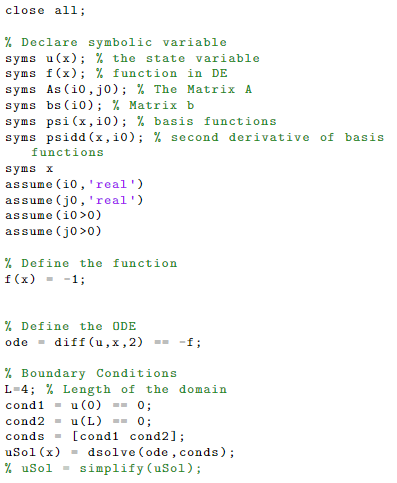
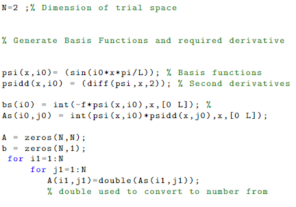
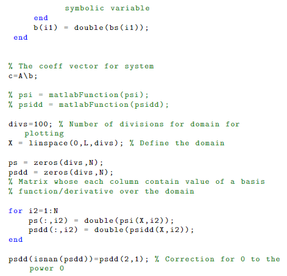
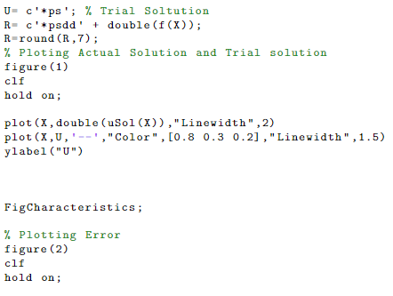
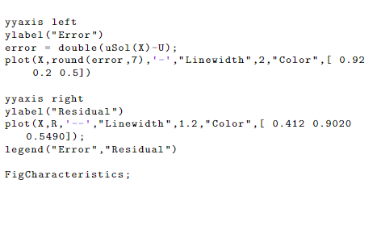

# Following the codes

Next, I will show the the codes in Matlab for each of the problems. You can check my code files [here](https://github.com/Giusseppe-97/Uncertainty_Quantification\docs\pages\demos\Getting Started\/code/).

# Poisson's equation:

# Stockastic Galerkin Problem 

This dataset describes airfreight comprises tracking and tracing events from a forwarding company’s 

#  Stockastic Collocation Problem

This dataset is trying to determine the league of a skillful gamer based on ability attributes. 