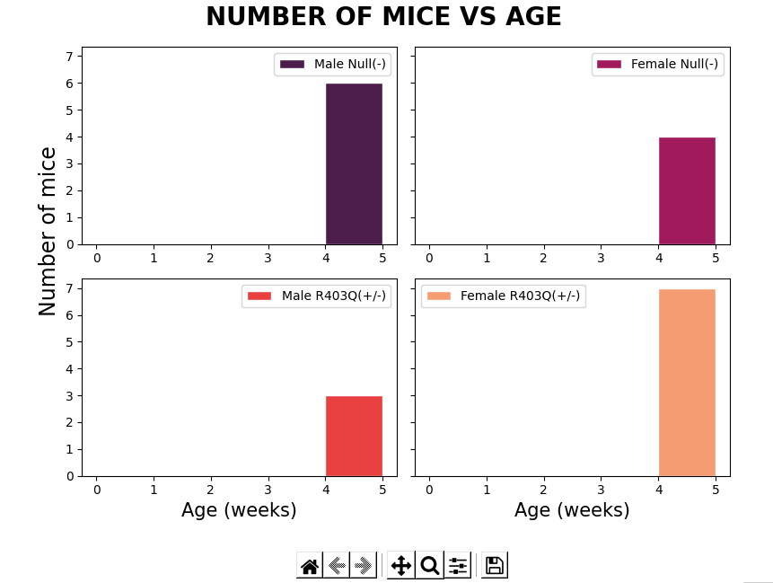
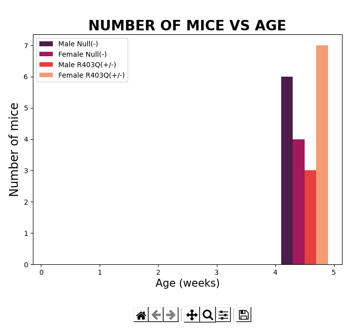

# Step by step

## Overview

Before proceeding, make sure that you have followed the [installation instructions](../../../installation/installation.html). You need the FiberSim folder, an Anaconda distribution of Python, and an active FiberSim environment to run this demo.

After following the [Running the App](../../../installation/Running the App/Running the App.html) instructions, and the [Run Data Instructions](../Run Data/Run Data.html), the lower part of the TheMiceCounter application will show you the plotted information preview, which looks something like this:

## What this demo does

This demo:

+ Explains the Display Preview frame
    - Which histograms can be seen
    
+ Explains the Reset and Quit buttons

+ Introduces the Excel Workbook file
    - Where are these plots saved

## Instructions

After running the application, two plots will appear in the lower part. The first one, located in the left side, is a histogram that ilustrates the individual data of 4 traits of the mice litter. You can see in the following image a mice litter in the month of may of 2021, showing the age in weeks in the x axis vs the amount of mice in the y axis, in which two of them are male and the other two female, and each are also divided between having a R403Q(+/-) mutation or not.

The other, located in the right side, is a histogram that ilustrates the grouped data of the same litter. You can see in the following image a mice litter in the month of may of 2021, showing the age in weeks in the x axis vs the amount of mice in the y axis, in which two of them are male and the other two female, and each are also divided between having a R403Q(+/-) mutation or not. here it is not separated in 4 different plots joined in one, but one plot only differentiated by color.

After previewing the plots, you have two options: Reset the application to rerun it, in which the user needs to click the Reset button, or Exiting the application, which the user would have to click on the Quit button. To rerun the application with new data or dates, make sure you have pressed the Reset button before. Not doing so could cause problems in the App that haven't been solved yet. On the other hand, if you clicked on the Quit button and want to rerun a simulation, you need to go back to the anaconda prompt and follow again the [Running the App](../../../installation/Running the App/Running the App.html) instructions.

After running the application, an excel file is saved, together with the respective tables and plots with the information chosen by the user. To understand where this data is saved, check out [Analyzing Data](../Analyzing Data/Analyzing Data.html) for the next step. 

