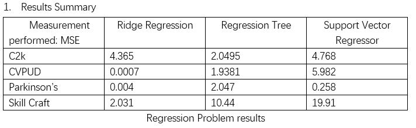

# Summary

Next, I will show the comparisson of the algorithms chosen for each dataset:

# Parkinson's:
Very interesting dataset with very positive results. The dataset is composed of a range of biomedical voice measurements from 42 people with early-stage Parkinson's disease recruited to a six-month trial of a telemonitoring device for remote symptom progression monitoring. The main aim of the data was to predict the motor and total UPDRS scores ('motor_UPDRS' and 'total_UPDRS') from the 16 voice measures. To do so, I used the following three algorithms:
- Linear Regression ridge 
- Support Vector Regressor 
- Regression Tree

 The ridge regression had ... mse, the regression tree had ... Mse, and the support vector regressor had a ... Mse. The performance was decent and also very similar between algorithms. Probably a lot to improve if I play longer with the parameters and of course adding a validation could help me be less bias in my results. Still, I feel very happy about these results.

# C2k
this dataset describes airfreight tracking and tracing events. It was very hard to understand given that the data was labeled poorly. Yet, eventually, I was able to figure it out. To carry out the analysis of this dataset, I used the following three algorithms:
- Linear Regression ridge 
- Support Vector Regressor 
- Regression Tree

# SkillCraft
This dataset is trying to determine the league of a skillful gamer based on ability attributes. To do so, I used the following three algorithms:
- Linear Regression ridge 
- Support Vector Regressor 
- Regression Tree
The ridge regression had ... mse, the regression tree had ... Mse, and the support vector regressor had a ... Mse. The performance was very irregular and results varied between algorithms. The first one, Ridge regression, has an increased bias, and it is hard to interpret the model. The complexity of this dataset made it very difficult to identify if the assumptions of the algorithm made sense or not. Support vector regressor had a bigger mean square error. 
Unlike other Regression models that try to minimise the error between the real and predicted value, the SVR tried to fit the best line within a threshold value. This threshold value in this case was the distance between the hyperplane and the boundary line, which changed more often. I also encountered a problem that in some cases, nan values interrupted my algorithm. 
Finally, the regressor tree gave a decent result, but the difference between all the algorithm's results makes me think that they might be over-fitting. A correlation matrix shown in the code helped me to better interpret the data, but I guess the biggest challenge was understanding the ordinal data. Given that we were trying to identify which league players were based on the skills, the problem seemed like a classification task. Yet, it was not because the data was continuous and therefore this created that my error was high when a player was put a value in between leagues.

# Cvpud
Very complex dataset to understand. More than running the code that we have written in the past months, I wanted to understand the data and that my conclusions were more than numbers. Yet, with this dataset, I struggled a lot because the data was poorly labeled. Additionally, to running my algorithms, I used a covariance matrix to see the relationship of the variables and find out that the dataset represented data about crimes. A possible prediction for this dataset was any of the last 18 columns, yet I focused on violentCrimesPerPop: a total number of violent crimes per 100K population (numeric - decimal) as my GOAL attribute. To do so, I used the following three algorithms:
- Linear Regression ridge 
- Support Vector Regressor 
- Regression Tree

