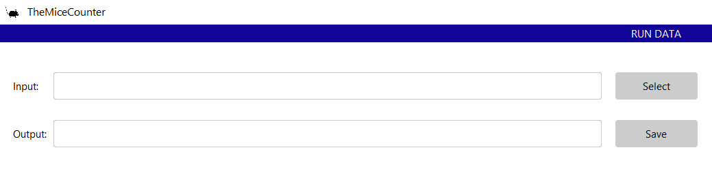

# Step by step

## Overview
Before proceeding, make sure that you have followed the [installation instructions](../../../installation/installation.html). You need TheMiceCounter folder and an Anaconda distribution of Python to run this demo.

After following the [Running the App](../../../installation/Running the App/Running the App.html) instructions, TheMiceCounter application would start and should look something like this:

## What this demo does

This demo:

+ Explains how to use the entries at the top of the application. This includes:
    - Setting the input data 
    - Setting the output folder 
    - Setting the date frame 
    - Running the data selected. 
    - Using the Reset bottom. 

## Instructions

The first step after opening the application is to select both the location of data that is going to be used and the folder where you want to save the results. This can be set on the input and output entries, as shown in the image below:

Now, it is time to set a time frame. Select in the calendar the starting date you want information from your mice litter and click on the initial date button. Do the same for the final date. You can change the dates by clicking on a new date in the calendar and then clicking the initial of final date button. 

After you have finished setting the time frame you are ready to Run the application. Click on the RUN button. Your results will take a second to appear in the lower part of the app. You can rerun new data by clicking the Reset button. Make sure you press this button before setting new data or running the application. This could cause problems in the App.

Check out [Histogram Display Preview](../Histogram_Display_Preview/Histogram_Display_Preview.html) for the next step. 

