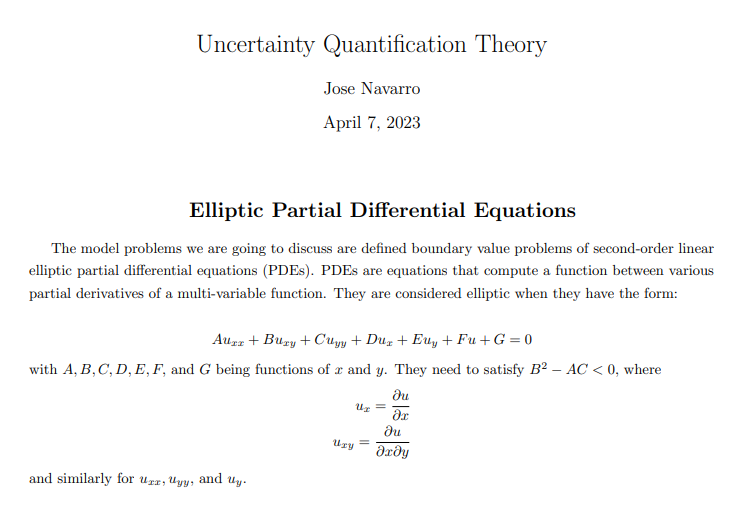
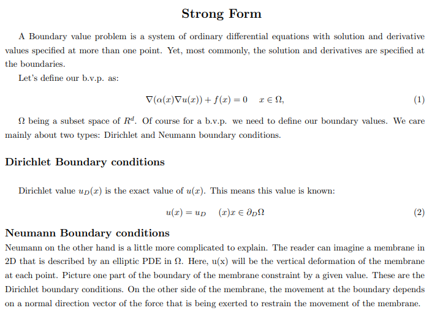
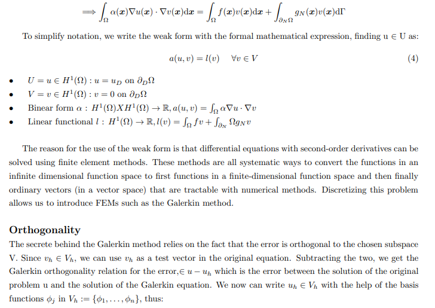
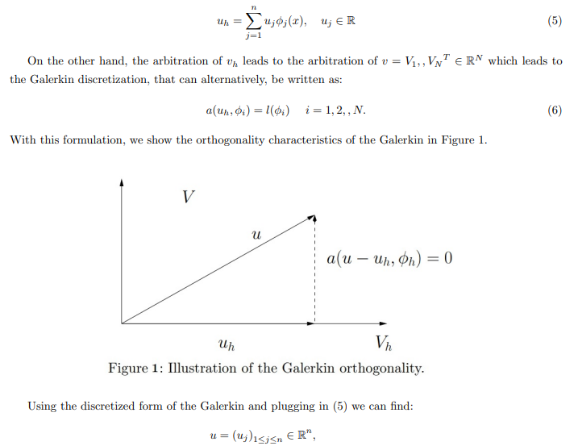
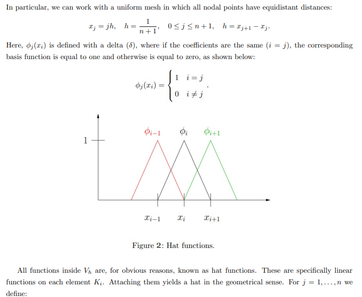
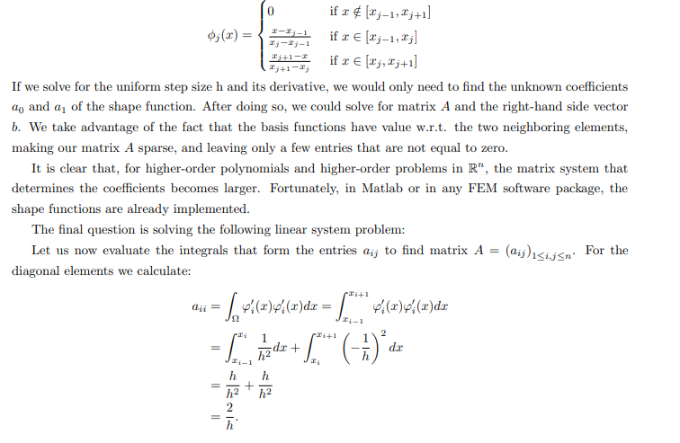
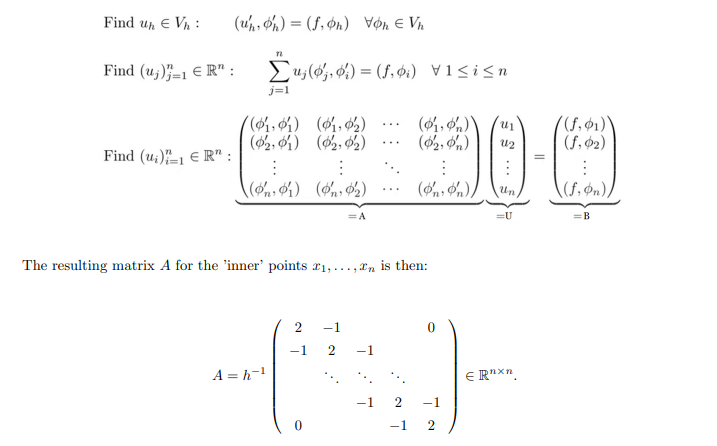

#  Summary

<!-- 

 -->

Theory on the approximation of vectors

The model problem we are going to discuss are defined boudary value problems of second-order linear elliptic partial differential equations (PDEs).
PDEs are equations which compute a function between various partial derivatives of a multivariable function. They  are considered elliptic when they have the form 
$$Au_{xx} +Bu_{xy} +  Cu_{yy} +Du_x +Eu_y + Fu + G = 0$$
with $A, B, C, D, E, F,$ and $G$ being functions of $x$ and $y$. They need to satisfy $B^{2}-AC<0$,
where $$u_x =∂u/∂x,$$ $$  u_{xy} =∂^2u/∂x∂y$$ and similatrly for $u_{xx},$ $ u_{yy}$, and  $u_{y}$.

A Boundary value problem is a system of ordinary differential equations with solution and derivative values specified at more than one point. Yet, most commonly, the solution and derivatives are specified at the boundaries.

Let's define our  b.v.p. as:
$$∇·(α(x; µ)∇u(x; µ)) + f(x; µ) = 0 x ∈ Ω$$
Ω being a subset space of $ℝ^d$

Of course foe a b.v.p. we need to define our boundary values. We care mainly about two types: Dirichlet and Neumann boundary conditions.
Dirichlet value u_D(x; µ) is the exact value of $u(x)$. This means this values is known. Neumann on the other hand is a little more complicated to explain. To keep this description short, imagine a membrane in 2D that is described by an elliptic PDE in Ω. Here, u(x) will be the vertical diformation of the membrane at each point. Picture one part of the boundary of the membrane constraint by given value.This is the Dirichlet boundary conditions. On the other side of the membrane, the movement at the boundary depends on a normal direction vector of the force that is being excerted to restrain the movement of the membrane. This is in a nutshell the Neumann condition.   
$$u(x; µ) = u_D(x; µ) x ∈ ∂_DΩ$$
$$α(x; µ)∇u(x; µ) · n(x) = g_N (x; µ) x ∈ ∂_N Ω$$.

This is the strong form of the model problem, yet we are interested on the weak form. The reason for this is that, differential equations with second-order derivatives can be solved using finite element methods. To reach this form, we use green's formulas and the residual formulation  to find, in a way, the external work at the boundary. We do so by performing integration by parts to arrive at expressions involving only first-order derivatives.

To simplify notation, we write the weak form with the formal mathemmatical expresion, finding $u ∈ U$ as: $$a(u,v) = l(v) ∀ v ∈ V $$

U = {u ∈ H1 (Ω) : u = uD on ∂_DΩ} 
V = {v ∈ H1 (Ω) : v = 0 on ∂_DΩ} 
Binear form a : H1 (Ω) × H1 (Ω) → R, a(u, v) = R Ω α∇u · ∇v I 
Linear functional l : H1 (Ω) → R, l(v) = R Ω fv + R ∂N Ω gN v 

Discretizing this problem allows us to introduce finite elements methods such as the Galerkin methods.

