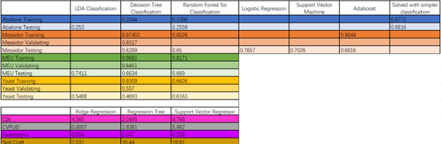

# Getting started

If this is the first time going through the project, make sure you have [installed the repository](../../installation/installation.html) before trying the demos. Ideally, any computer is able to run the repository. Additionally, the Jupyter Notebooks for mac users where also added in case you want to addapt the repository to your own needs.

You can check the summary of the results of each algorithm in this colored table:

## Note

The following describes the results of the project for both the classification and regression algorithms. 

