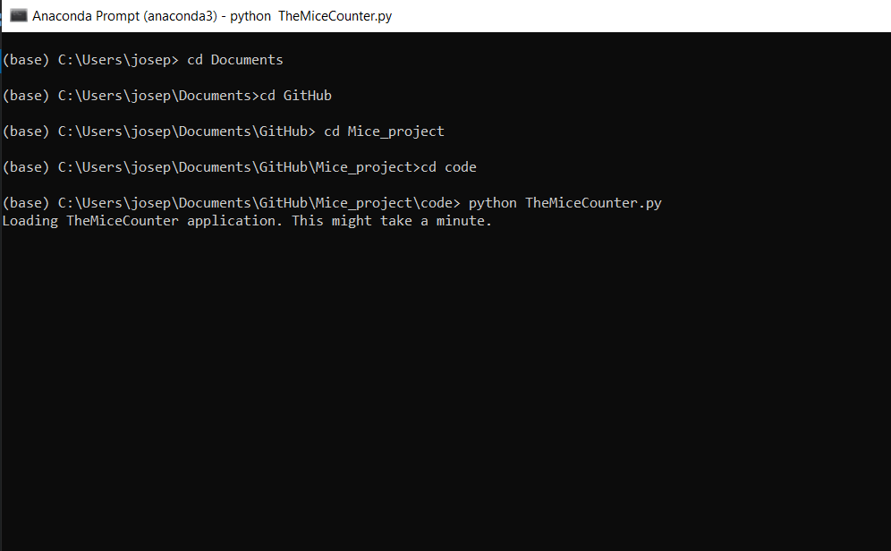

## Overview

Right now, TheMiceCounter application needs to be run with the Anaconda distribution of Python. In the future it is set to work uniquely with TheMiceCounter exe file located in the bin folder. 

## Instructions

Before proceeding, make sure that you have followed the [installation instructions](../installation.html). 

### Getting ready

+ Open an Anaconda Prompt

```
+ Change directory to `<TheMiceCounter_dir>/code`, where `<TheMiceCounter_dir>` is the directory where you installed TheMiceCounter. 
```

Here is a short video showing you how to use the `cd` command.

[cd_video.PNG](https://drive.google.com/file/d/1g90Awaesj1UyHP0lA-S-X5uSDjvw26II/view?usp=sharing)

### Run the application

+ Type:
 ```
 python TheMiceCounter.py 
 ```

+ You should see text appearing in the terminal window, showing that the application is starting. 



When it opens (this may take a few minutes), you should see something similar to the image below.


